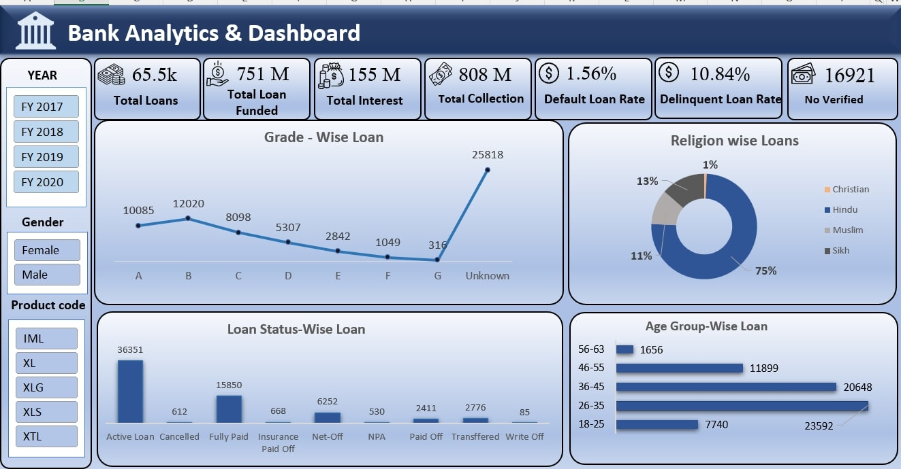

# 📊 Banking Loan & Transaction Analytics Project

## 📌 Project Overview
Banks face challenges in tracking **loan performance** and understanding **customer spending patterns**.
This project analyzes **65,000+ loan records** and **₹255M+ debit/credit transactions** to uncover insights that support better **risk management, decision-making, and customer analysis**.

- 🗄 **SQL** used for data extraction, cleaning, and analysis  
- 📈 Dashboards built in **Excel, Power BI, and Tableau**  
- 🎯 Focus on **loan defaults, repayment trends, and spending behavior**

---

## 🛠 Tools & Technologies
- **SQL** → Stored procedures, advanced queries, aggregations
- **Excel** → Pivot tables, KPI dashboards
- **Power BI** → Loan dashboards (drill-down & filters)
- **Tableau** → Transaction dashboards (visual storytelling)

---

## 📂 Folder Structure

```
/Banking-Analytics-Project
│
├── /data
│   ├── customer_data.xlsx
│   ├── loan_data.xlsx
│   └── transaction_data.xlsx
│
├── /dashboards
│   ├── Excel/
│   │   └── banking_dashboard.xlsx
│   ├── PowerBI/
│   │   └── banking_dashboard.pbix
│   └── Tableau/
│       └── banking_dashboard.twbx
│
├── /SQL
│   └── data_processing.sql
│
└── README.md
```

---

## 📑 Key KPIs & Insights

### 🔹 Loan Data
- Total Loans: **65.5K**
- Total Funded: **₹751M**
- Total Collection: **₹808M**
- Default Loan Rate: **1.56%**
- Top Age Group: **18–25 years**
- Avg. Loan Amount per Customer: **₹11,465**

### 🔹 Debit & Credit Data
- Total Transaction Amount: **₹255M**
- Top Bank by Transactions: **Axis Bank**
- Top Expense Category: **Utility Bill Payment (₹26M)**
- Highest MoM Drop: **96% in December**

---
# Preview
---
Excel Dashboard  
  

## 📊 Dashboards
- **Excel** → Loan details, customer repayment, debit/credit summaries
- **Power BI** → Loan performance trends & risk analysis
- **Tableau** → Transaction breakdown, bank & category analysis

---

## 🚀 How to Use
1. Clone the repository:  
   ```bash
   git clone https://github.com/your-username/Banking-Analytics-Project.git
   ```
2. Open `/data` folder to access raw datasets  
3. Explore dashboards in `/dashboards` (Excel, Power BI, Tableau)  
4. Run SQL queries in `/SQL` for analysis

---

## 📌 Project Summary
✔ Analyzed **65K+ loan records** and **₹255M+ transactions**  
✔ Built interactive dashboards using **Excel, Power BI, and Tableau**  
✔ Used **SQL stored procedures** for advanced aggregations  
✔ Identified trends in **loan defaults, repayment patterns, and spending habits**

---

## 🎯 Key Learnings
- Data cleaning, transformation, and visualization of **multi-source datasets**
- Hands-on experience with **BI tools (Excel, Power BI, Tableau)** and **SQL**
- Understanding of **default risk, customer segmentation, and branch-level performance**
- Improved **team collaboration and storytelling with data**

---

